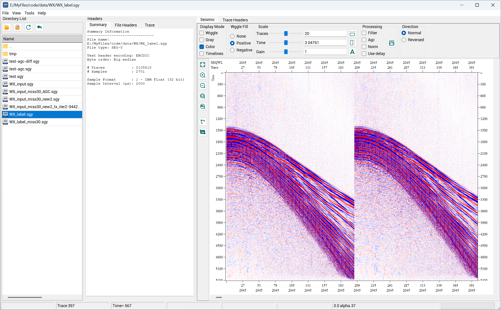
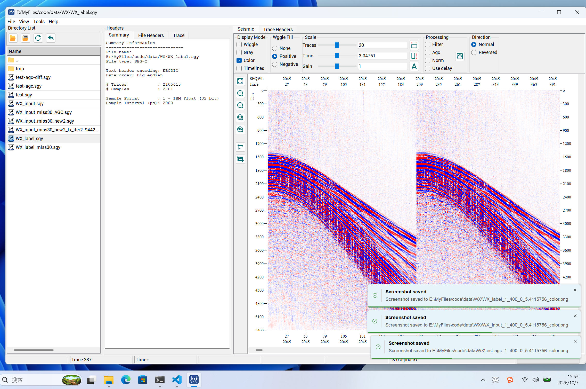
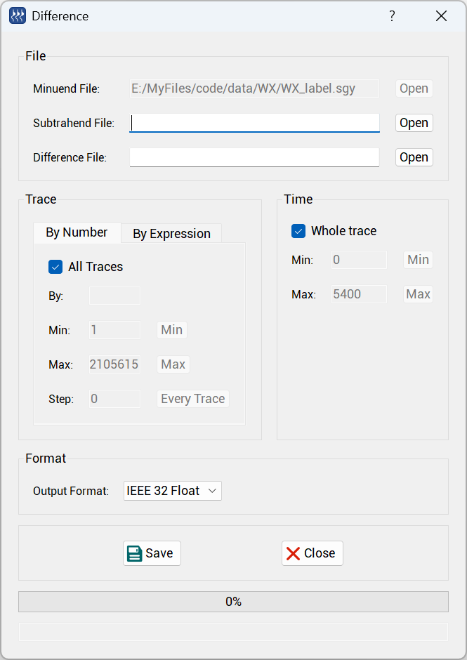
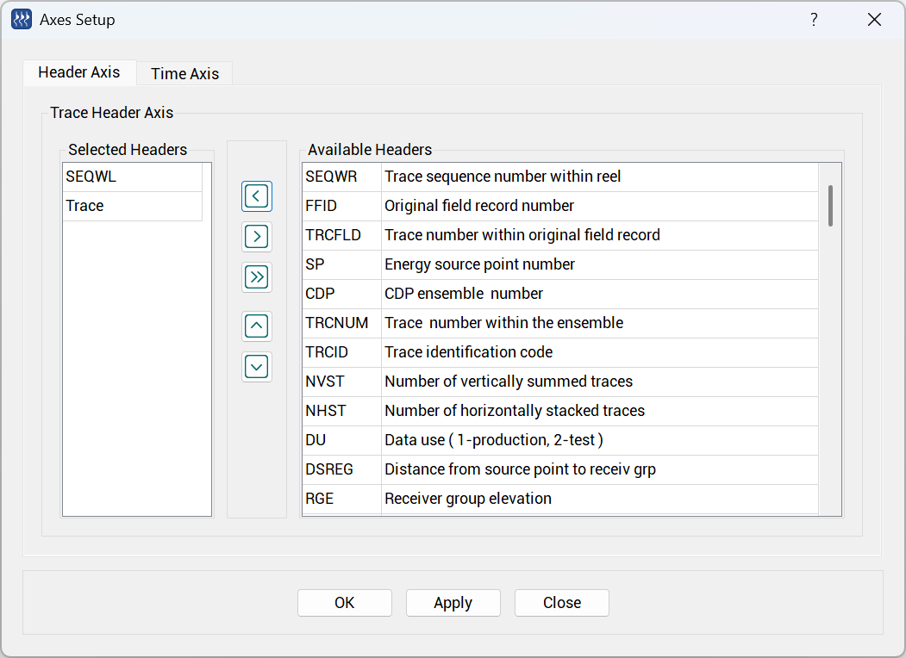
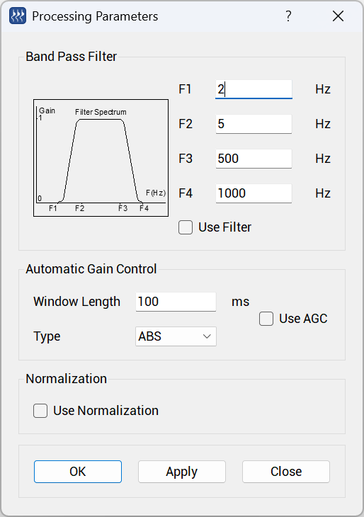

<div align="center">
  <h1 align="center">地震数据查看器SeisSee</h1>
</div>

<div align="center">一个支持多平台的地震数据查看工具,源代码开发者为：https://mail.dmng.ru/freeware/</div>
<br>
<p align="center">
  <a href="https://github.com/wangweiwei104/SeisSee/releases/latest">
    
  </a>
  <a href="https://github.com/wangweiwei104/SeisSee/releases/latest">
    
  </a>
  <a href="https://github.com/wangweiwei104/SeisSee/fork">
    
  </a>
  <a href="https://github.com/wangweiwei104/SeisSee/star">
    
  </a>
</p>

## 界面


主界面


截图功能


difference


axis setup


process

## 功能

- 增加地震数据的右侧和底部坐标轴，形成四周对称式坐标，符合国人审美和行业通用标准
- 增加地震数据截图功能，并使用带圆角提示框显示操作结果。
- 增加打开文件入口。
- 增加 Difference功能，用于计算两个地震数据的差值。
- 增加文件目录浏览界面的右键菜单，可以获取文件名、文件路径、打开文件所在目录
- 改进高 DPI、多显示器环境下的界面布局和显示效果。
- 统一界面字体、字体大小及坐标轴等显示样式的设置方式。
- 调整 Axis Setup 和多个控件的布局与间距。
- 改进图标在不同 DPI 屏幕上的显示，并支持窗口在不同 DPI 屏幕间移动。
- 补全道头字段（至240，兼容GeoEast）显示。
- 实现 Save as 界面 apply process的实际功能
- 精心设计的高DPI图标。

## 安装方法

### Windows

需要 Qt 5.15.2 MinGW 8.1、Inno Setup 6.3 或更高版本，并将项目使用的 Qt 和 MinGW `bin` 目录配置在默认路径或传入参数。脚本通过 `windeployqt` 扫描并打包应用所需的 Qt DLL、平台插件和运行库；安装包版本从 `SeiSeeMp/mainwindow.h` 中的 `#define VERSION` 自动读取：

```powershell
.\scripts\package-windows.ps1
```

可通过 `-QtBin`、`-MinGWBin`、`-InnoSetupCompiler` 和 `-Jobs` 覆盖工具路径及构建参数。安装程序输出到 `dist/windows`。

### Linux

#### 使用 Docker 构建（推荐）

Docker 构建环境基于 CentOS 7 兼容的 manylinux2014（glibc 2.17），使用 Qt 5.15.2 构建并打包为 AppImage。较新的 Ubuntu（如 22.04/26.04）保持 glibc 向后兼容，因此该构建可用于这些 x86_64 系统；运行仍需要桌面环境及 AppImage 所需的宿主系统库。

Docker 会将宿主机 `/home/ww/Qt` 挂载到容器相同位置，使用已安装的 Qt 5.15.2（`/home/ww/Qt/5.15.2/gcc_64`），并配置 `QMAKE`、`PATH`、`LD_LIBRARY_PATH`、`QT_PLUGIN_PATH`、`QT_QPA_PLATFORM_PLUGIN_PATH`、`QML2_IMPORT_PATH`、`CMAKE_PREFIX_PATH` 和 `PKG_CONFIG_PATH`。

在项目根目录运行：

```bash
docker build -f docker/linux.Dockerfile -t seisee-linux-builder .
mkdir -p dist/linux
docker run --rm \
  --user "$(id -u):$(id -g)" \
  -e VERSION=4.0.0-alpha.1 \
  -e JOBS="$(nproc)" \
  -v /home/ww/Qt:/home/ww/Qt:ro \
  -v "$PWD/dist/linux:/workspace/dist/linux" \
  seisee-linux-builder
```

生成的 AppImage 位于 `dist/linux`。CentOS 7 上若 AppImage 无法挂载，可尝试：

```bash
APPIMAGE_EXTRACT_AND_RUN=1 ./dist/linux/SeiSee-4.0.0-alpha.1-x86_64.AppImage
```

Docker 镜像只负责构建，不是应用运行镜像；请在桌面会话中运行生成的 AppImage。

#### VS Code（Windows 和 Linux 共用）

仓库中的 `.vscode` 配置同时包含 Windows 和 Linux 工具链：任务会按当前操作系统选择 qmake、make、运行程序及 Qt Designer；调试器分别提供 Linux 和 Windows 启动项。C/C++ 扩展的配置可在状态栏的配置选择器中切换 `Linux` 或 `Windows MinGW`。两边需要分别安装与各自 Qt 工具链相匹配的 C/C++ 扩展及编译工具。qmake 会在源码目录生成平台相关的 Makefile 和目标文件；如果在同一工作区切换操作系统，先运行 `Clean build outputs` 再重新构建。

#### 在本机打包

需要 Qt 5 开发环境、C++ 编译工具、`linuxdeploy`、`linuxdeploy-plugin-qt` 和 `appimagetool`，并在 x86_64 Linux 上运行。默认安装包版本为 `4.0.0-alpha.1`：

```bash
sudo apt-get install libxcb-xinerama0
source scripts/qt-env.sh
./scripts/package-linux.sh
```

`scripts/qt-env.sh` 会为当前终端配置 Qt 环境变量，并在找不到 qmake 时明确报错。要在新终端自动加载，可将 `source /home/ww/code/SeisSee/SeiSee/scripts/qt-env.sh` 添加到所用 shell 的启动文件中；也可通过设置 `QT_ROOT` 覆盖默认 Qt 安装路径。

本机 `~/.bashrc` 已配置上述 Qt 环境变量；当前终端可运行 `source ~/.bashrc` 立即加载，之后新开的 Bash 终端会自动生效。若使用其他用户或机器，可使用 `scripts/qt-env.sh` 单独配置。

可通过 `QMAKE`、`MAKE`、`LINUXDEPLOY`、`APPIMAGETOOL`、`VERSION` 和 `JOBS` 环境变量覆盖工具及构建参数。AppImage 输出到 `dist/linux`。建议在目标用户所需支持范围内较旧的 Linux 发行版上构建，以提高 glibc 兼容性。

## Git 用户名和邮箱配置

Git 提交需要配置作者姓名和邮箱。为当前用户的所有仓库设置（全局配置）：

```bash
git config --global user.name "你的姓名"
git config --global user.email "你的邮箱"
```

如果只想为当前仓库设置，请先进入仓库目录，再省略 `--global`：

```bash
git config user.name "你的姓名"
git config user.email "你的邮箱"
```

查看当前仓库最终生效的配置：

```bash
git config user.name
git config user.email
```

仓库级配置优先于全局配置。提交记录会包含配置的姓名和邮箱；如果不希望公开个人邮箱，可以使用代码托管平台提供的隐私邮箱地址。此配置用于标记提交作者，不会设置 GitHub 登录或推送认证。

## 第三方库

- [qt-toast](https://github.com/niklashenning/qt-toast)：截图操作提示，源码及 MIT 许可证位于 `third_party/qt-toast`，通过独立 qmake 静态库项目构建。通知定位使用 Qt `QScreen::availableGeometry()`，适配 Windows 任务栏及 Linux 桌面保留区域。

## 更新日志

[更新日志](./CHANGELOG.md)

## 赞赏

<div>暂不需要~</div>


## 关注

不用


## 免责声明

本项目仅供学习交流用途，开发者不负任何责任

## 许可证

[MIT](./LICENSE) License &copy; 2025-PRESENT [wangweiwei104](https://github.com/wangweiwei104)
